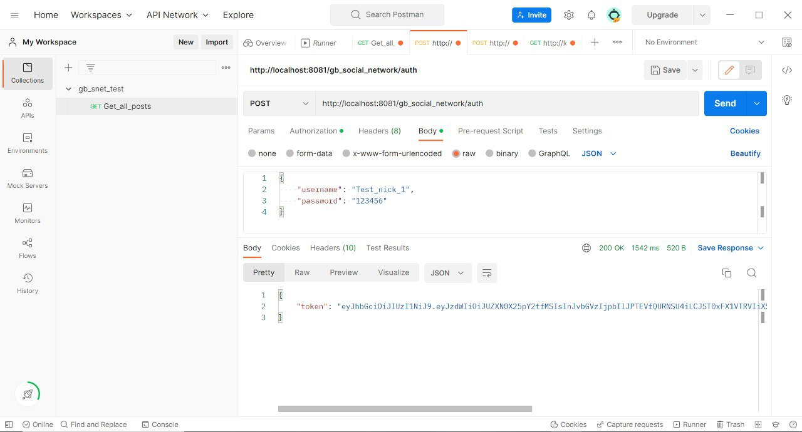
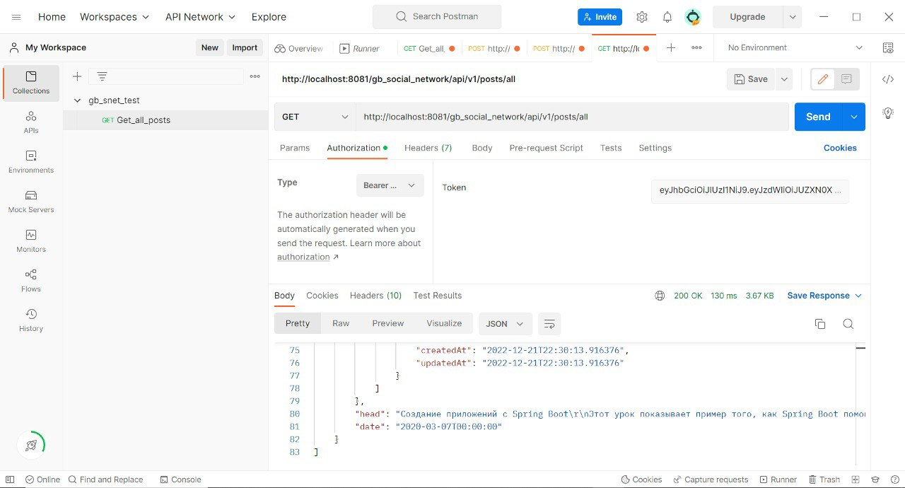
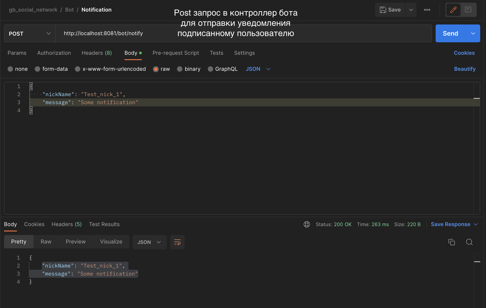
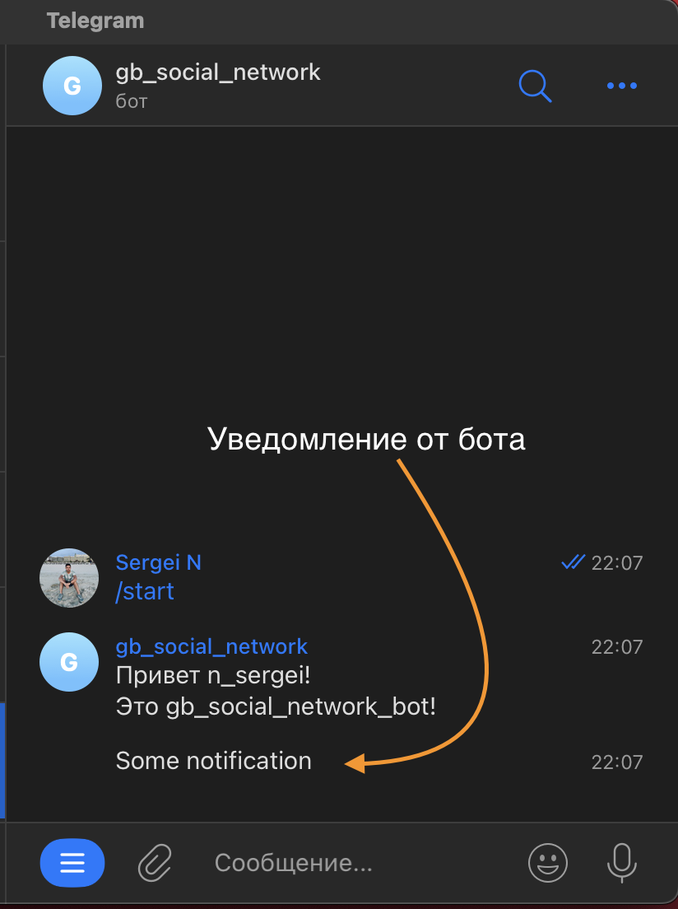

Проект gb_social_network
========================
Групповой проект факультета java разработки GeekBrains - GB Social Network

Цель проекта
------------
Получение практических навыков командной разработки посредством реализации проекта социальной сети (аналог твиттера) на базе веб-интерфейса. Данная социальная сеть будет публиковать новости, авторский контент. Социальная сеть будет иметь возможность подписки на каналы с различным контентом (новости, блоги и т.д.).

Архитектура проекта
-------------------

Проект представляет собой набор из сервисов:

    - Сервис backend api  включающий в себя: сервис по регистрации/авторизации, сервис работы с постами, сервис взаимодействия пользователей, сервис уведомлений (в разработке), сервис отправки электронных писем (в разработке)
    - Frontend на React (в разработке)
    - База данных Postgres
    - Telegram bot

Используемые технологии:
------------------------
В проекте предполагается использование следующих технологий:

    - Spring boot
    - Postgres
    - Flyway
    - Rabbitmq
    - React
    - Docker compose
    - Telegram Bot API
    - Swagger
    - JWT

Функционал проекта:
-------------------

На текущий момент реализован следующий фунеционал:

    - Регистрация новых пользователей
    - Аутенфикация пользователей по логину / паролю
    - Возможность смены пароля
    - Просмотр и редактирование списка друзей пользователя
    - Публикация пользователем "постов" с возможностью прикрепления фото
    - Просмотр своих / чужих постов
    - Уведмления о событиях в телеграм боте
    - Уведомления о событиях по электронной почте

Деплой:
-------

Проект разворачивается локально. 

БД поднимается в докере с помоющью src/main/resources/docker/docker-compose.yaml.
Все необходмые миграции прописаны в Flyway.

Модуль Backend закпускается через src/main/java/ru/gb/backend/BackendApplication.java на порте 8080.
Модуль bot закпускается через src/main/java/ru/gb/bot/BotApplication.java порт 8081.

Ссылки:
-------

ТЗ проекта: https://docs.google.com/document/d/1Rwk382TkX1YBWELjp_S4BsBSnedoNQH6V2QzXCfadOA/edit?usp=sharing

Доска трелло: https://trello.com/b/yNmyLn38

Примеры работы соновных модулей:
----------
Аутенфикация

Контроллер post

Пост запрос в контроллер бота для отправки уведомления пользователю:

Присланное уведомление пользователю от бота:

